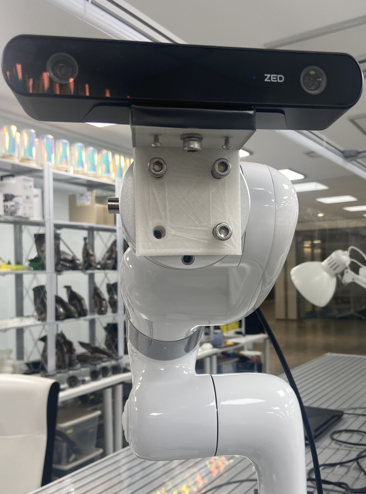
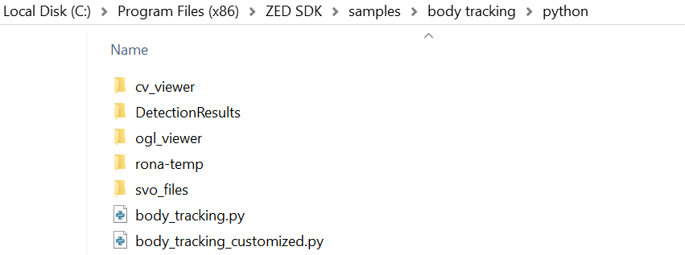

# Collaborative Robot Arm Body Tracker

This repository provides a starting point for implementing a collaborative robot arm body tracker using a ZED camera and a Ufactort xArm. The project involves configuring the ZED camera, establishing the physical connection between the camera and the robot arm, and implementing the necessary Python code for body tracking.

## Requirements

- ZED Camera with ZED SDK version 3.8: [ZED SDK 3.8](https://www.stereolabs.com/developers/release/3.8)
- Python version 3.8.0
- Ufactory xArm (6-joint robot arm)

## Setup Steps

### 1. Configure ZED Camera on PC

Follow the instructions in the [ZED SDK documentation](https://www.stereolabs.com/docs/) to install and configure the ZED SDK on your system.

### 2. Physically Connect ZED Camera to the Robot Arm

We designed and 3D printed an end effector to connect the camera and the robot arm.

### 3. ZED Camera Code

- Place the `body_tracking_customized.py` file in the directory specified in the image below. If you are using an operating system other than Windows, locate the path where sample projects are saved for your OS and insert the file there.

  

- Complete the 'To-Do' sections in the code and make any necessary modifications according to your requirements.

### 4. Robot Tracking Code

- Note: The provided code is specific to the Ufactort xArm. For other robot arms, you will need to adapt the code accordingly. You may also need to use different programming languages, such as Doosan robot with DRL language.

- Complete the 'To-Do' sections in the code specific to the robot arm you are using.

### 5. Run Both Codes

Ensure both the ZED camera code and the robot tracking code are completed and execute both scripts.

### 6. Demo

## Note

This repository serves as a starting point, and certain sections of the code are marked as 'To-Do' for customization based on specific requirements. The provided code is intended to inspire and guide the implementation of a collaborative robot arm body tracker. Feel free to enhance and extend the functionality according to your project needs.

Additionally, you can find a tutorial on the basics of robot arms authored by me [here](https://www.youtube.com/watch?v=LM_INiNuWcs&list=PLTQAfwphGUyHzWAlYQcYkhI6lLmYAdobT).

